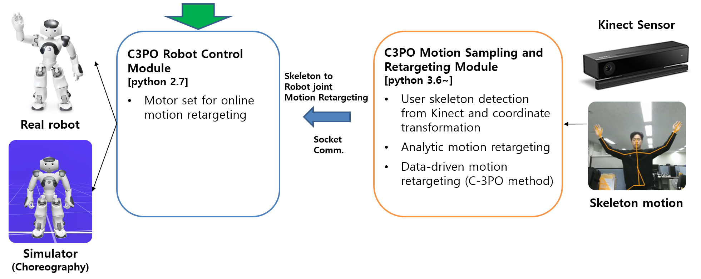

 ## [Robot Control Module] C-3PO Motion Retargeting
This project is a robot control module for motion retargeting. 
Robot control module receives the retargeted motor values from motion retargeting module and 
set these to the real NAO/Pepper robot or choreography simulator. Following figure represents the overall 
structure of our C-3PO motion retargeting system. 



### Getting Started
```buildoutcfg 
1) Set the appropriate port numbers and run the "demo.py" file.
2) Run the "pykinect_stream.py" of the motion retargeting module and wait to be connected, then enjoy. 
```

### Update
```buildoutcfg
* Training module will be updated soon
```

### File descriptions
```buildoutcfg
    .
    ├── figs                                     
    │   └── system.png      # Figure for README file
    ├── CommonObject.py     # Commonly used functions and variables
    ├── demo.py             # Demo file
    ├── README.md           
    └── requirements.txt
```

### External Dependencies 
<pre>
Python 2.7
* <a href="http://doc.aldebaran.com/2-5/dev/python/install_guide.html">naoqi</a>
* <a href="http://doc.aldebaran.com/2-4/dev/community_software.html">Choreography</a>
</pre>

### Requirements
```buildoutcfg
pip install -r requirements.txt
```

### Publication
Please refer to the following paper and video for more detailed information.
* Kim and Lee, C-3PO: Cyclic-Three-Phase Optimization for Human-Robot Motion Retargeting based on 
Reinforcement Learning, ICRA 2020, 
[[Paper]](https://arxiv.org/abs/1909.11303), 
[[YouTube]](https://www.youtube.com/watch?v=C37Fip1X0Y0&t=19s)

```buildoutcfg
@article{kim2019c,
  title={C-3PO: Cyclic-Three-Phase Optimization for Human-Robot Motion Retargeting based on Reinforcement Learning},
  author={Kim, Taewoo and Lee, Joo-Haeng},
  journal={arXiv preprint arXiv:1909.11303},
  year={2019}
}
```

### Acknowledgment 
This work was supported by the ICT R&D program of MSIP/IITP [2017-0-00162, Development of Human-care 
Robot Technology for Aging Society].